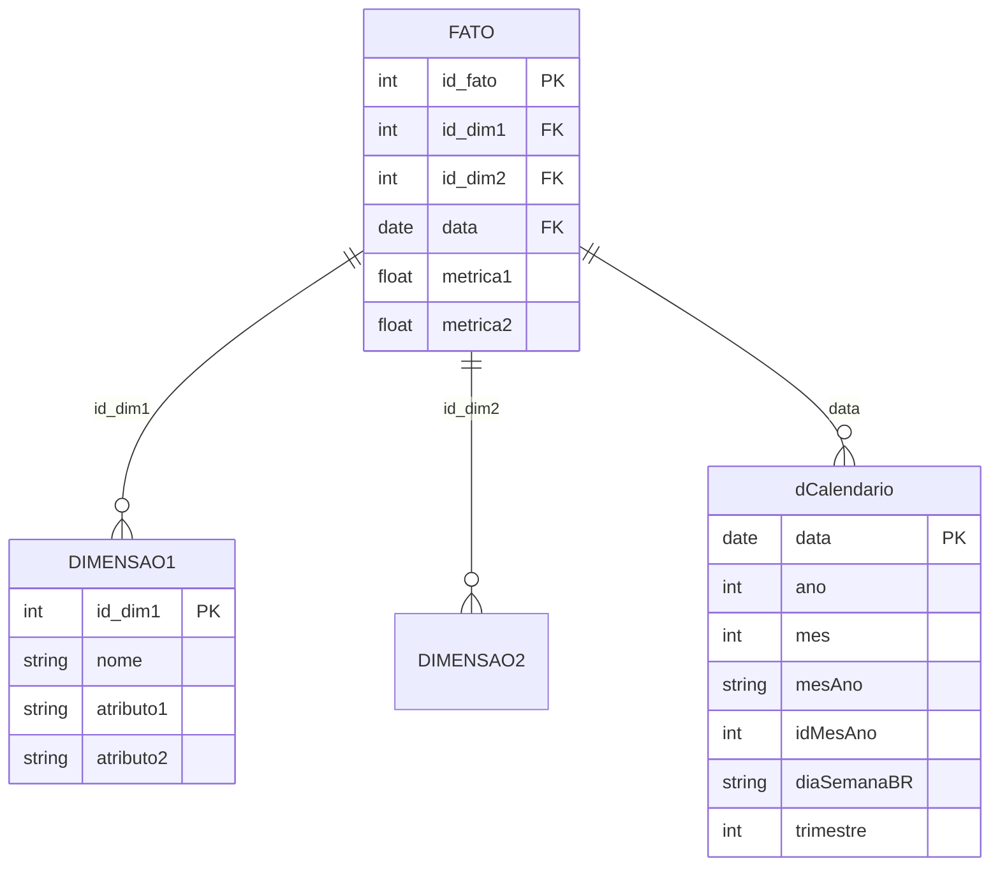

# BI Data Generator PRO 📊

**Star Schema · 30 Setores · dCalendario**  
Dados reais para seu projeto de Business Intelligence

Gere bases profissionais no modelo estrela em segundos. Tabelas fato, dimensões e dCalendario prontos para Power BI, Tableau e qualquer ferramenta de BI.

[](https://streamlit.io)
[](https://python.org)
[](https://pandas.pydata.org)

---

## 📌 Badges Rápidos

| Recurso | Status |
|---------|--------|
| Setores | 30 |
| Linhas máx. | 100k |
| Download | .zip |
| Cadastro | Gratuito |

---

## 📑 Índice

1. [Visão Geral](#-visão-geral)
2. [Funcionalidades](#-funcionalidades)
3. [Como Usar](#-como-usar-em-4-passos)
4. [Setores Disponíveis](#-setores-disponíveis-30)
5. [Estrutura Star Schema](#-estrutura-star-schema)
6. [Tecnologias](#-tecnologias)
7. [Instalação](#-instalação)
8. [Adicionar Novo Setor](#-como-adicionar-um-novo-setor)
9. [Casos de Uso](#-casos-de-uso)
10. [Contribuições](#-contribuições)
11. [Licença](#-licença)

---

## 📋 Visão Geral

O **BI Data Generator PRO** é uma solução completa para criar conjuntos de dados realistas e contextualizados para **30 setores de negócio distintos**. Perfeito para:

- ✅ Desenvolvimento e teste de dashboards e relatórios BI
- ✅ Demonstração de funcionalidades sem dados reais sensíveis
- ✅ Treinamento e educação em Business Intelligence
- ✅ Prototipagem rápida de soluções de análise de dados
- ✅ Validação de modelos de dados em Star Schema

Todos os dados gerados seguem o padrão **Star Schema**, com tabelas fato e tabelas dimensão otimizadas para análise, e incluem uma tabela `dCalendario` compatível com Power Query.

---

## ✨ Funcionalidades

### 🎯 Geração de Dados Multi-Setor
Suporte para **30 setores de negócio especializados**:

<details>
<summary><b>🌾 Agronegócio</b></summary>
Safras, culturas, propriedades e insumos
</details>
<details>
<summary><b>🍔 Alimentos & Bebidas</b></summary>
Produção, plantas, produtos e fornecedores
</details>
<details>
<summary><b>🏗️ Construção Civil</b></summary>
Obras, custos, materiais e fornecedores
</details>
<details>
<summary><b>🤝 CRM</b></summary>
Oportunidades, contas, contatos e atividades comerciais
</details>
<details>
<summary><b>🏪 E-commerce</b></summary>
Pedidos, clientes, produtos, fretes e pagamentos
</details>
<details>
<summary><b>📚 Educação</b></summary>
Matrículas, alunos, cursos e instrutores
</details>
<details>
<summary><b>⚡ Energia</b></summary>
Consumo, medidores, subestações e tarifas
</details>
<details>
<summary><b>🏟️ Esportes</b></summary>
Partidas, atletas, clubes e competições
</details>
<details>
<summary><b>💊 Farmacêutico</b></summary>
Produtos, representantes, vendas e estoque
</details>
<details>
<summary><b>💰 Financeiro</b></summary>
Transações bancárias, contas e agências
</details>
<details>
<summary><b>🏦 Fintech</b></summary>
Transações, cartões, usuários, comerciantes e antifraude
</details>
<details>
<summary><b>🏛️ Governo & Setor Público</b></summary>
Despesas, receitas, licitações e contratos
</details>
<details>
<summary><b>🏨 Hotelaria</b></summary>
Reservas, hóspedes, hotéis, quartos e canais
</details>
<details>
<summary><b>🏠 Imobiliário</b></summary>
Vendas, aluguéis, imóveis e corretores
</details>
<details>
<summary><b>🏭 Indústria</b></summary>
Produção, máquinas, insumos e operadores
</details>
<details>
<summary><b>⚖️ Jurídico</b></summary>
Processos, advogados, clientes e tribunais
</details>
<details>
<summary><b>🚚 Logística</b></summary>
Entregas, transportadoras, rotas e clientes
</details>
<details>
<summary><b>📣 Marketing Digital</b></summary>
Campanhas, canais, performance e conversões
</details>
<details>
<summary><b>⛏️ Mineração</b></summary>
Extrações, minas, minerais e equipamentos
</details>
<details>
<summary><b>🚗 Mobilidade</b></summary>
Viagens, motoristas, passageiros, rotas e veículos
</details>
<details>
<summary><b>🛢️ Petróleo & Gás</b></summary>
Produção, poços, plataformas e custos operacionais
</details>
<details>
<summary><b>🏢 Recursos Humanos</b></summary>
Horas trabalhadas, funcionários, projetos e cargos
</details>
<details>
<summary><b>☁️ SaaS B2B</b></summary>
Assinaturas, MRR, churn, NPS e planos
</details>
<details>
<summary><b>🏥 Saúde</b></summary>
Atendimentos, pacientes, médicos e procedimentos
</details>
<details>
<summary><b>🛡️ Seguros</b></summary>
Apólices, segurados, corretores e sinistros
</details>
<details>
<summary><b>🎬 Streaming</b></summary>
Plays, assinantes, conteúdos, artistas
</details>
<details>
<summary><b>💻 Tecnologia</b></summary>
Contratos SaaS, clientes e planos
</details>
<details>
<summary><b>📡 Telecom</b></summary>
Chamadas, assinantes, planos e torres
</details>
<details>
<summary><b>✈️ Turismo</b></summary>
Viagens, pacotes, agências e destinos
</details>
<details>
<summary><b>🛒 Varejo</b></summary>
Vendas, clientes, produtos e filiais
</details>

### 📐 Arquitetura Star Schema
- Tabelas **Fato** com métricas de negócio
- Tabelas **Dimensão** com dados descritivos
- Relacionamentos bem definidos
- Índices e chaves configuradas

### 📅 Calendário Integrado
- Tabela `dCalendario` compatível com **Power Query**
- Colunas: Data, Ano, Mês, MêsAno, IdMesAno, DiaSemanaBR, QuartalAno
- Análises temporais e comparações year-over-year

### 📊 Dashboards Interativos
- Dashboards específicos para cada setor
- Construídos com **Plotly**
- KPIs customizados por setor

### ⚙️ Configuração Flexível
- Seleção de setor (30 opções)
- Período de tempo customizável
- Volume ajustável: **100 até 100.000 registros**

### 📦 Exportação Conveniente
- Múltiplos arquivos CSV
- Compactação automática em .zip
- Nomes padronizados e descritivos

---

## 🚀 Como Usar em 4 Passos

| Passo | Ação | Descrição |
|-------|------|-----------|
| **01** | 🏭 Escolha o setor | Selecione entre 30 setores com dados contextualmente corretos |
| **02** | 📅 Defina o período | Configure as datas — a dCalendario é gerada automaticamente |
| **03** | 🚀 Clique em Gerar | A base completa é gerada em segundos com relações íntegras |
| **04** | 📦 Baixe o .zip | CSVs prontos para importar no Power BI, Tableau ou Python |

---

## 📊 Setores Disponíveis (30)

[⬆️ Voltar ao Índice](#-índice)

| # | Emoji | Setor | Descrição |
|---|-------|-------|-----------|
| 1 | 🌾 | Agronegócio | Safras, culturas, propriedades e insumos |
| 2 | 🍔 | Alimentos & Bebidas | Produção, plantas, produtos e fornecedores |
| 3 | 🏗️ | Construção Civil | Obras, custos, materiais e fornecedores |
| 4 | 🤝 | CRM | Oportunidades, contas, contatos e atividades |
| 5 | 🏪 | E-commerce | Pedidos, clientes, produtos, fretes e pagamentos |
| 6 | 📚 | Educação | Matrículas, alunos, cursos e instrutores |
| 7 | ⚡ | Energia | Consumo, medidores, subestações e tarifas |
| 8 | 🏟️ | Esportes | Partidas, atletas, clubes e competições |
| 9 | 💊 | Farmacêutico | Produtos, representantes, vendas e estoque |
| 10 | 💰 | Financeiro | Transações, contas e agências |
| 11 | 🏦 | Fintech | Transações, cartões, usuários e antifraude |
| 12 | 🏛️ | Governo | Despesas, receitas, licitações e contratos |
| 13 | 🏨 | Hotelaria | Reservas, hóspedes, hotéis, quartos e canais |
| 14 | 🏠 | Imobiliário | Vendas, aluguéis, imóveis e corretores |
| 15 | 🏭 | Indústria | Produção, máquinas, insumos e operadores |
| 16 | ⚖️ | Jurídico | Processos, advogados, clientes e tribunais |
| 17 | 🚚 | Logística | Entregas, transportadoras, rotas e clientes |
| 18 | 📣 | Marketing Digital | Campanhas, canais, performance e conversões |
| 19 | ⛏️ | Mineração | Extrações, minas, minerais e equipamentos |
| 20 | 🚗 | Mobilidade | Viagens, motoristas, passageiros, rotas e veículos |
| 21 | 🛢️ | Petróleo & Gás | Produção, poços, plataformas e custos |
| 22 | 🏢 | Recursos Humanos | Horas trabalhadas, funcionários, projetos e cargos |
| 23 | ☁️ | SaaS B2B | Assinaturas, MRR, churn, NPS e planos |
| 24 | 🏥 | Saúde | Atendimentos, pacientes, médicos e procedimentos |
| 25 | 🛡️ | Seguros | Apólices, segurados, corretores e sinistros |
| 26 | 🎬 | Streaming | Plays, assinantes, conteúdos, artistas |
| 27 | 💻 | Tecnologia | Contratos SaaS, clientes e planos |
| 28 | 📡 | Telecom | Chamadas, assinantes, planos e torres |
| 29 | ✈️ | Turismo | Viagens, pacotes, agências e destinos |
| 30 | 🛒 | Varejo | Vendas, clientes, produtos e filiais |

---

## 📐 Estrutura Star Schema

Cada base gerada inclui:



### Componentes:

| Componente | Descrição |
|------------|-----------|
| **Tabela Fato** | Chaves estrangeiras (id_*) e métricas de negócio |
| **Tabelas Dimensão** | Chaves primárias e atributos descritivos |
| **dCalendario** | Data, Ano, Mês, MesAno e IdMesAno — compatível com Power Query |
| **Exportação** | CSVs compactados em um único .zip |

---

## 🛠 Tecnologias

[⬆️ Voltar ao Índice](#-índice)

| Tecnologia | Versão | Função |
|-----------|--------|--------|
| **Python** | 3.8+ | Linguagem principal |
| **Streamlit** | ≥1.32.0 | Framework web interativo |
| **Pandas** | ≥2.0.0 | Manipulação e análise de dados |
| **NumPy** | ≥1.26.0 | Computação numérica |
| **Faker** | ≥24.0.0 | Geração de dados sintéticos realistas |
| **Plotly** | ≥5.18.0 | Gráficos e dashboards interativos |

---

## 🚀 Instalação

[⬆️ Voltar ao Índice](#-índice)

### Pré-requisitos
- Python 3.8+
- pip
- Git

### Passo a Passo

```bash
# 1. Clone o repositório
git clone https://github.com/RodrigoAiosa/bi_data_generator.git
cd bi_data_generator

# 2. Crie ambiente virtual (recomendado)
python -m venv .venv

# Ative no Linux/macOS:
source .venv/bin/activate
# Ative no Windows:
.venv\Scripts\activate

# 3. Instale dependências
pip install -r requirements.txt

# 4. Execute
streamlit run app.py
```

A aplicação abrirá em `http://localhost:8501`.

---

## 🔧 Como Adicionar um Novo Setor

[⬆️ Voltar ao Índice](#-índice)

### Passo 1: Criar o Gerador

```python
"""generators/novo_setor.py — Setor: Novo Setor"""

from datetime import date
import pandas as pd
import numpy as np
from .helpers import new_ids, dcalendario, rand_dates

def gerar_novo_setor(n: int, start: date, end: date) -> dict:
    """Gera dados sintéticos para Novo Setor."""
    
    # Dimensões
    dim_entidade = pd.DataFrame({
        "id_entidade": new_ids(min(n, 1000)),
        "nome": [f"Entidade {i}" for i in range(1, min(n, 1000) + 1)],
    })
    
    # Fato
    fato = pd.DataFrame({
        "id_fato": new_ids(n),
        "id_entidade": np.random.choice(dim_entidade["id_entidade"], n),
        "data": rand_dates(start, end, n),
        "valor": np.random.uniform(100, 5000, n),
    })
    
    return {
        "DimEntidade": dim_entidade,
        "FatoNovo": fato,
        "dCalendario": dcalendario(start, end),
    }
```

### Passo 2: Exportar no `__init__.py`

```python
from .novo_setor import gerar_novo_setor

__all__ = [
    # ... existentes
    "gerar_novo_setor",
]
```

### Passo 3: Registrar no `config.py`

```python
from generators import gerar_novo_setor

SETORES = {
    # ... existentes
    "🆕 Novo Setor": gerar_novo_setor,
}

SETORES_INFO = [
    # ... existentes
    ("🆕", "Novo Setor", "Descrição do setor"),
]
```

**Pronto!** Seu novo setor estará disponível.

---

## 🎯 Casos de Uso

[⬆️ Voltar ao Índice](#-índice)

| Área | Aplicação |
|------|-----------|
| **Desenvolvimento BI** | Testar dashboards antes de dados reais |
| **Educação** | Ensinar modelagem e análise de dados |
| **Demonstração** | Apresentar ferramentas BI com dados contextualizados |
| **Testes e QA** | Validar pipelines ETL com volumes conhecidos |
| **Prototipagem** | Criar MVPs rapidamente |

---

## 🤝 Contribuindo

[⬆️ Voltar ao Índice](#-índice)

1. Fork o repositório
2. Crie branch: `git checkout -b feature/novo-setor`
3. Commit: `git commit -m 'Adiciona novo setor'`
4. Push: `git push origin feature/novo-setor`
5. Abra um Pull Request

---

## 📄 Licença

[⬆️ Voltar ao Índice](#-índice)

Código aberto. Consulte o arquivo LICENSE para detalhes.

---

## 📧 Contato

[⬆️ Voltar ao Índice](#-índice)

**Desenvolvedor:** Rodrigo Aiosa  
**GitHub:** [RodrigoAiosa](https://github.com/RodrigoAiosa)  
**Repositório:** [bi_data_generator](https://github.com/RodrigoAiosa/bi_data_generator)

---

## 🎓 Recursos Adicionais

### Power BI Integration
- Star Schema nativo
- Tabela de datas para análises temporais
- CSVs prontos para importação

### Tableau & Qlik Sense
- Estrutura relacional clara
- Sem ambiguidades ou ciclos
- Dados limpos e validados

### Melhores Práticas
- Use `dCalendario` para análises de tempo
- Relacione tabelas fato com dimensões apropriadas
- Utilize IDs para melhor performance

---

[⬆️ Voltar ao Índice](#-índice)

**Desenvolvido com ❤️ para a comunidade de BI e Data Analytics**
